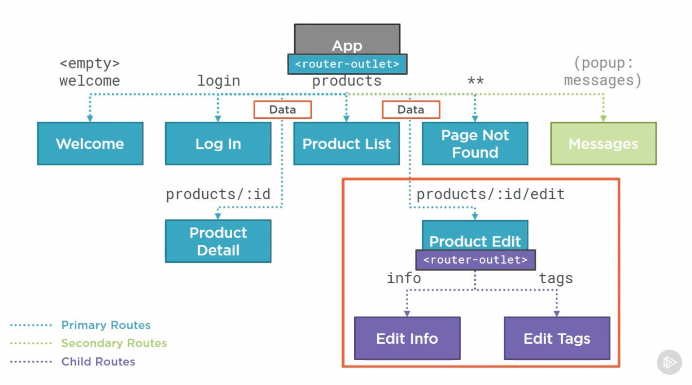
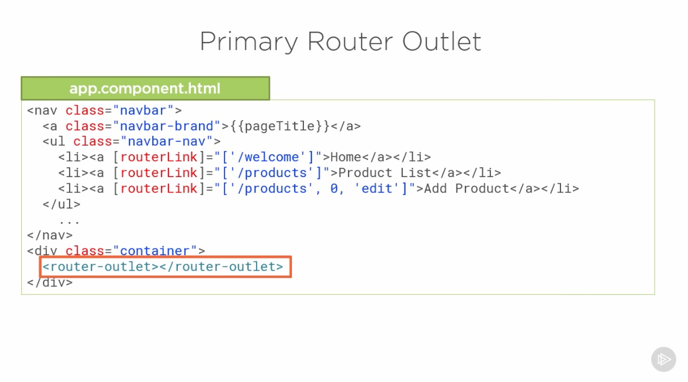

# Introduction

## Table of Contents

[Child Routes](#Child-Routes)\
[Using Child Routes](#Using-Child-Routes)\
[Configuring Child Routes](#Configuring-Child-Routes)\
[Activating Child Route](#Activating-Child-Route)\
[Obtainig Data for a Child Route](#Obtainig-Data-for-a-Child-Route)\
[Validating Across Child Routes](#Validating-Across-Child-Routes)\
[Checklists and Summary](#Checklists-and-Summary)

---

### Child Routes

---

### Using Child Routes

---

### Configuring Child Routes

---

### Placing the Child View

---

### Activating Child Route

---

### Obtainig Data for a Child Route

---

### Validating Across Child Routes

---

### Checklists and Summary

