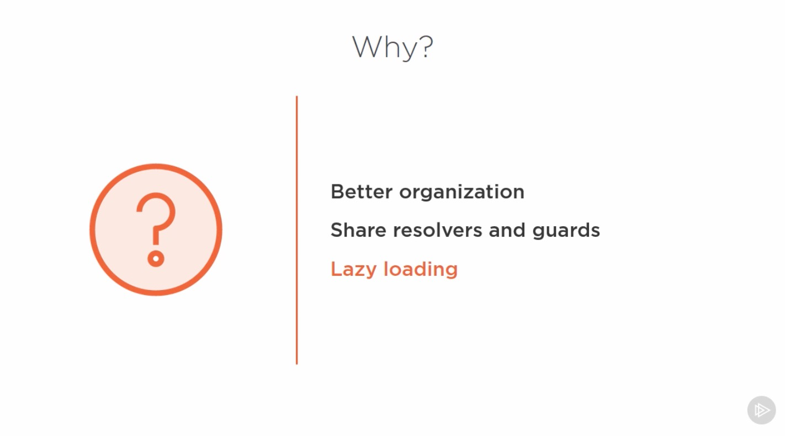
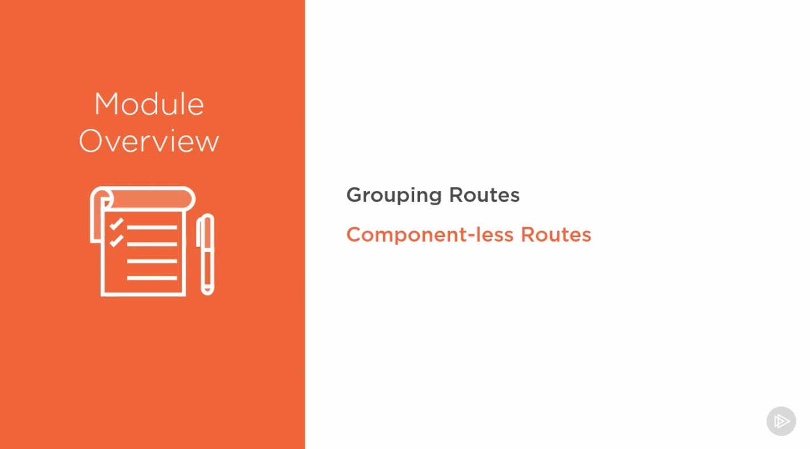
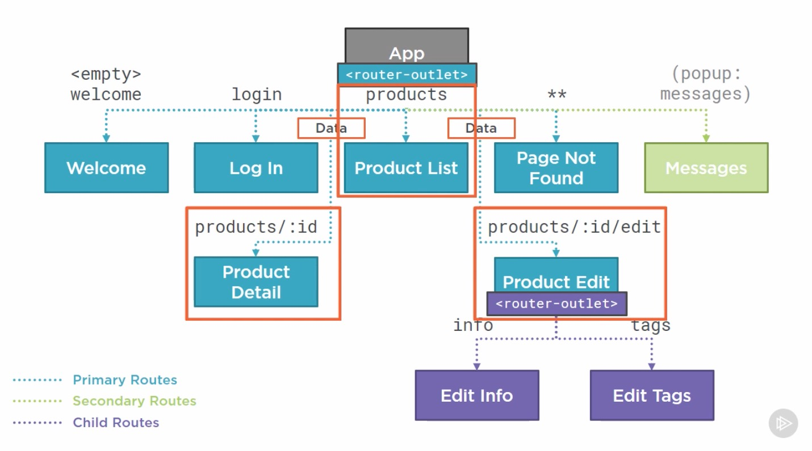
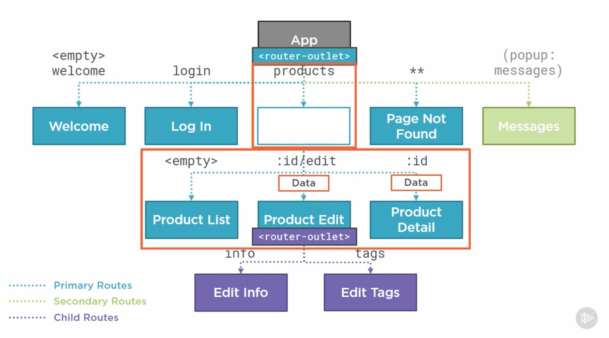
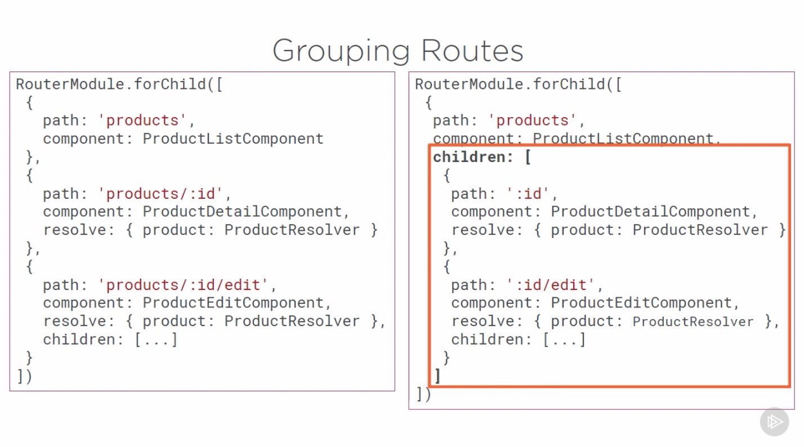

# Introduction

## Table of Contents

[Introduction](#Introduction)\
[Grouping Routes](#Grouping-Routes)\

---

### Introduction

  
  

Instead of defining product routs at the same level of the route hierarchy as the welcome, login, and other routes, we group our routes under a component-less parent rout.
  
 

---

### Grouping Routes

  
