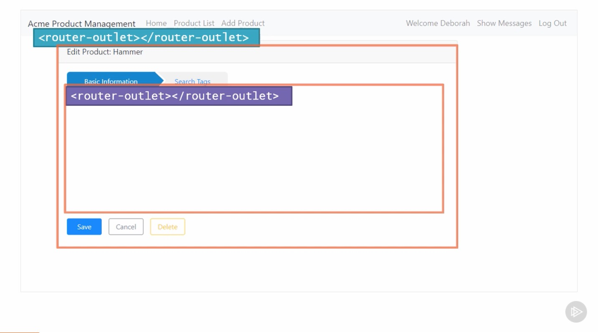
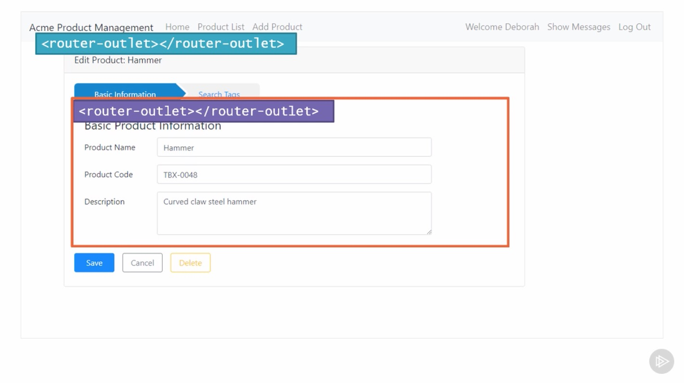
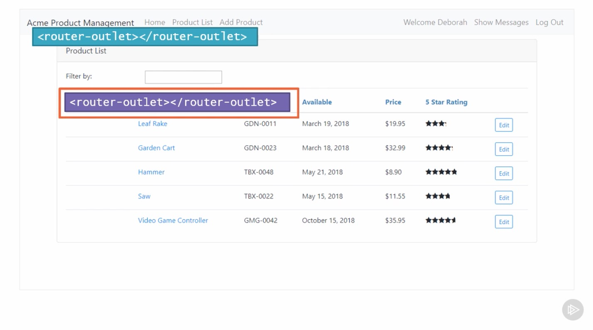
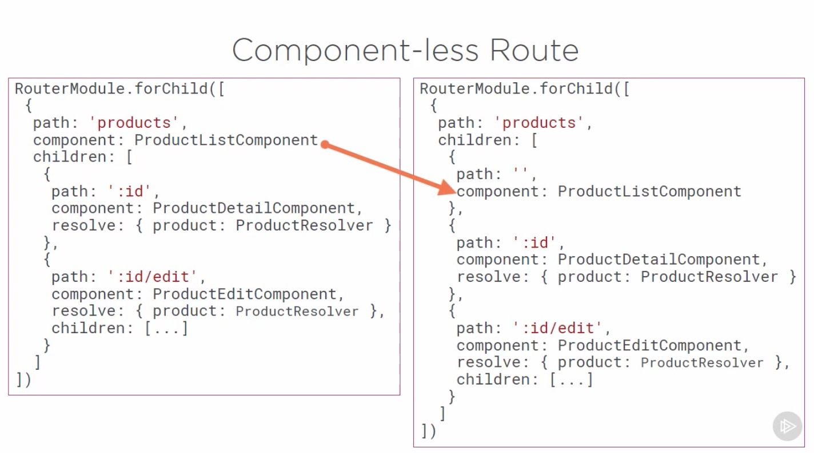
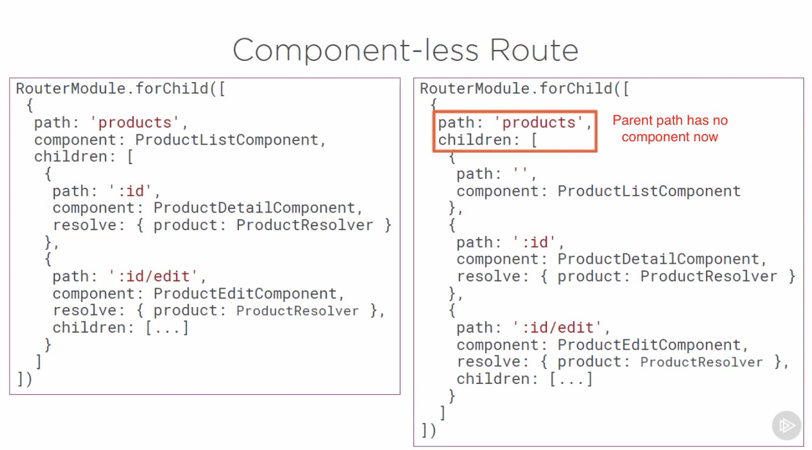
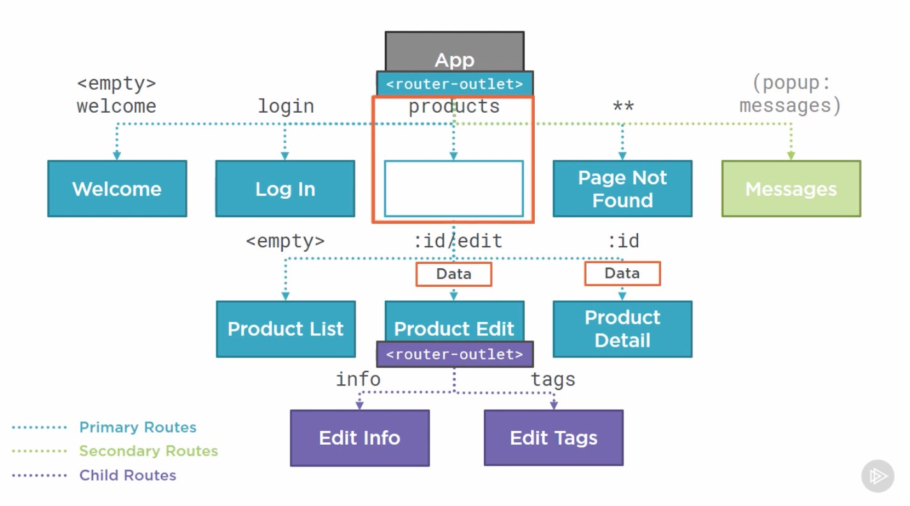
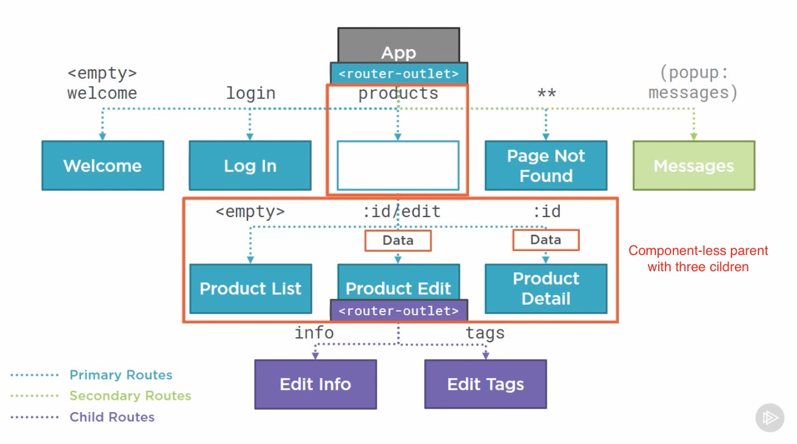
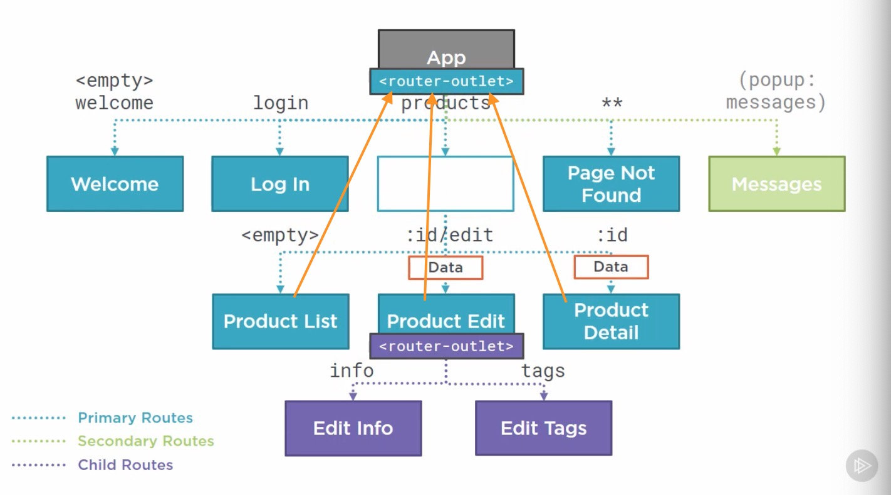

# Introduction

## Table of Contents

[Introduction](#Introduction)\
[Grouping Routes](#Grouping-Routes)\
[Component-less Routes](#Component-less-Routes)\

---

### Introduction

  
  

Instead of defining product routs at the same level of the route hierarchy as the welcome, login, and other routes, we group our routes under a component-less parent rout.
  
 

---

### Grouping Routes

  

---

### Component-less Routes

Child routes are displayed in router-outlet defined within the parent component's template, so info tab component template appears within this child router-outlet.
  
  

To display our new child routes, we'd need a child router-outlet in the parent component's template, which in this case is the Product List page.
 
We don't want the product detail and product edit pages appearing within the Product List page.
To get around this we use a component-less route.
 
  
  

Now hierarchy looks like this:
  
Since parent rout is component-less the child component templates appear in the primary router-outlet.
  

