# Final Words

---

We began at the beginning with routing basics. We configured our first set of routes, an empty default route, a welcome route, and a wildcard route that displays a Page Not Found message.
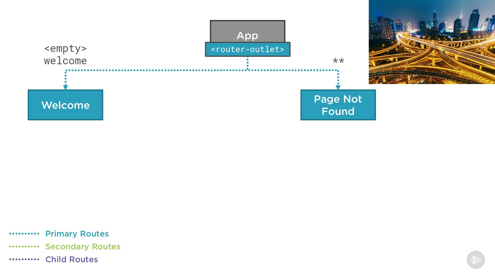  

---

Then we examined how to build feature modules and routed to the login component in a user feature module and the product list component in a product feature module. We discussed route path naming strategies and now see the benefits of using a common route path name, such as products in our example, and we found that route order matters.
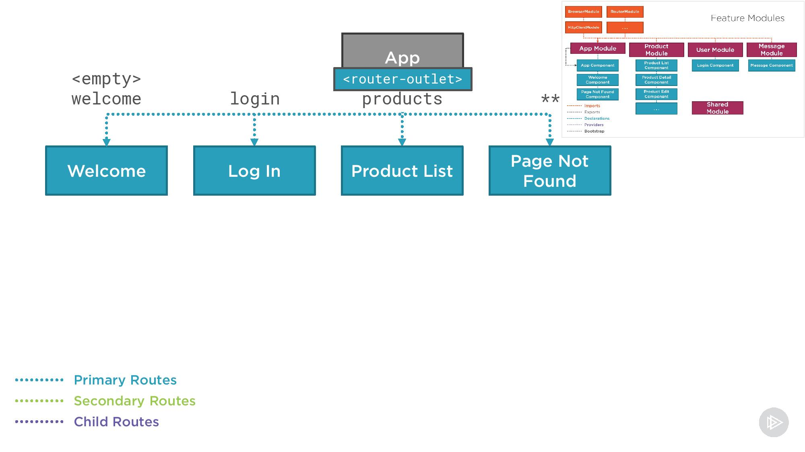  

---

We can swiftly pass data as we route from one component to the next using route parameters. We looked at required, optional, and query parameters. We used required parameters to define which product to display in the product detail and product edit component template. And we used query parameters to retain the product list selections when navigating to the product detail and back again.
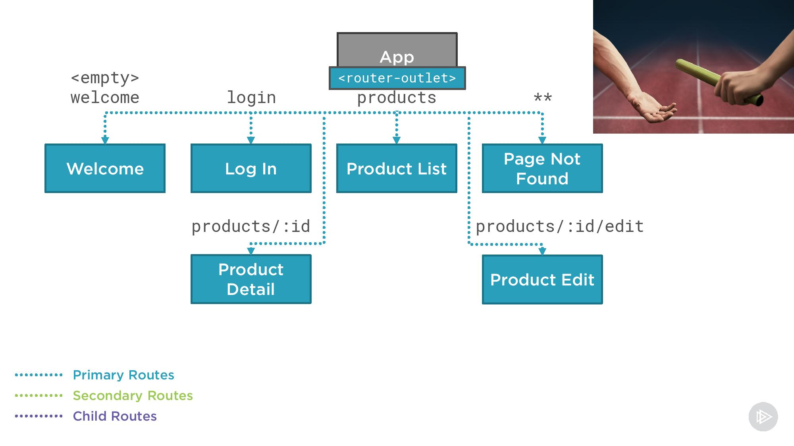  

---

For a nicer visual experience, we can retrieve the data required for display in a component's template before routing to that component using route resolvers. We learned how to build resolver service to prefetch the data for our product detail and product edit components. No more partial page display as our component waits for its data.
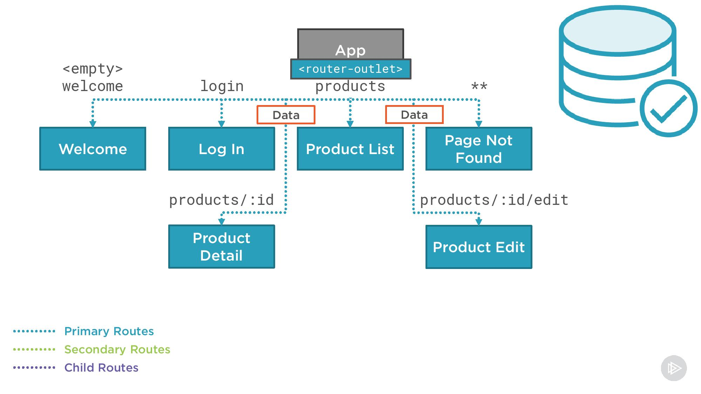  

---

Using child routes, we define a route hierarchy better organize, encapsulate, and navigate through our application where we place the form in the product edit component template with a tabbed edit page and defined a router outlet for display of the child tab components. As the user clicks a tab, the associated component's template is displayed in that router outlet. And we saw how to share the single instance of the product data from the parent's route resolver.
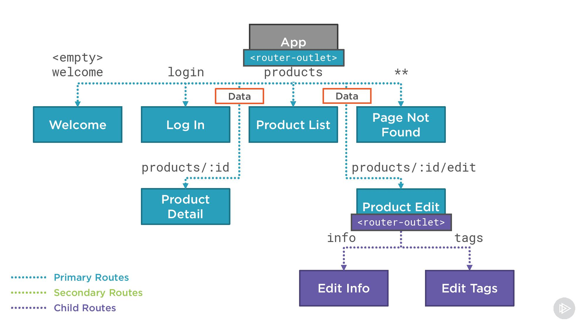  

---

Then came the biggest change to our route hierarchy, we grouped our child routes under a component-less parent route. This helps us better organize our routes and share route guards without requiring the parent to provide a router outlet. The child component templates are displayed in the next higher level of the hierarchy. In this example, the primary router outlet.
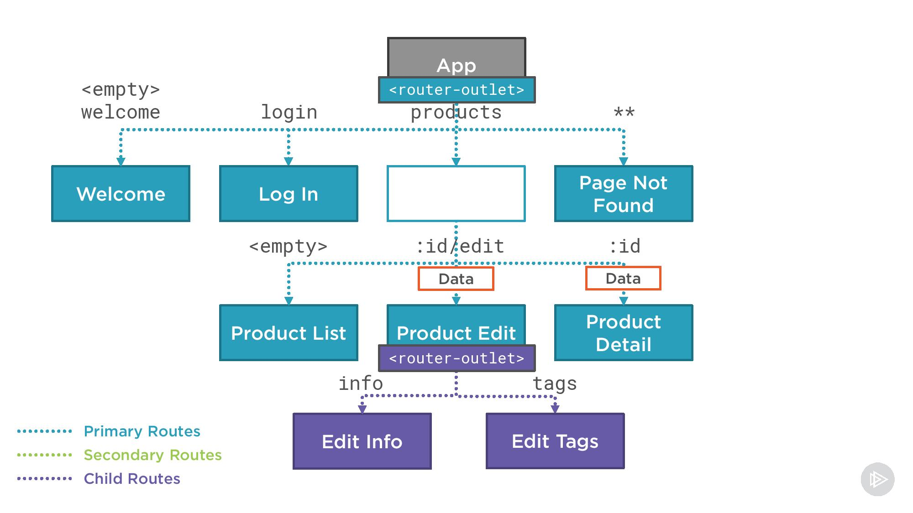  

---

Then we switch gears a bit and spend some time polishing our routes. We learned how to style the selected route, animate our route transitions, watch our routes, and react to routing events to display a spinner.
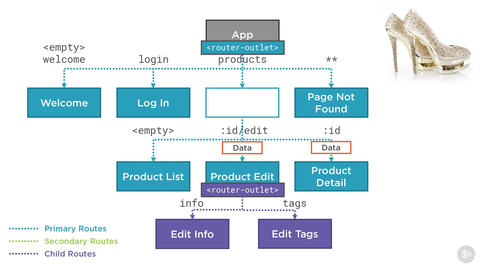  

---

Secondary routes make it easy to display multiple panels or panes on the page, each containing different content and supporting independent navigation. We displayed a messages component in our secondary router outlet named popup. We could also display other content in this secondary outlet, such as a product summary when editing product information.
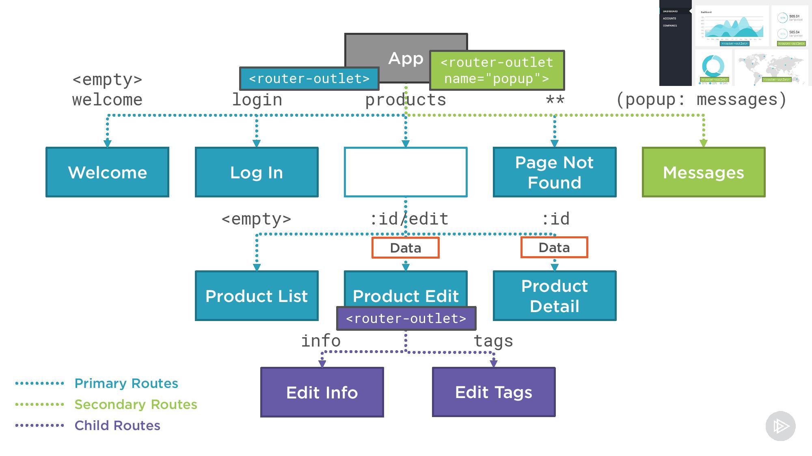  

---

We use route guards to ensure navigation to a route is permitted for security, authorization or monitoring purposes, or to prevent the user from leaving a route without a confirmation. We added a canActivate guard to the product's parent route to ensure that the user is logged in before accessing any product data, and we added a canDeactivate guard to the product edit parent route. This guard notifies the user of any unsafe changes before navigating away.
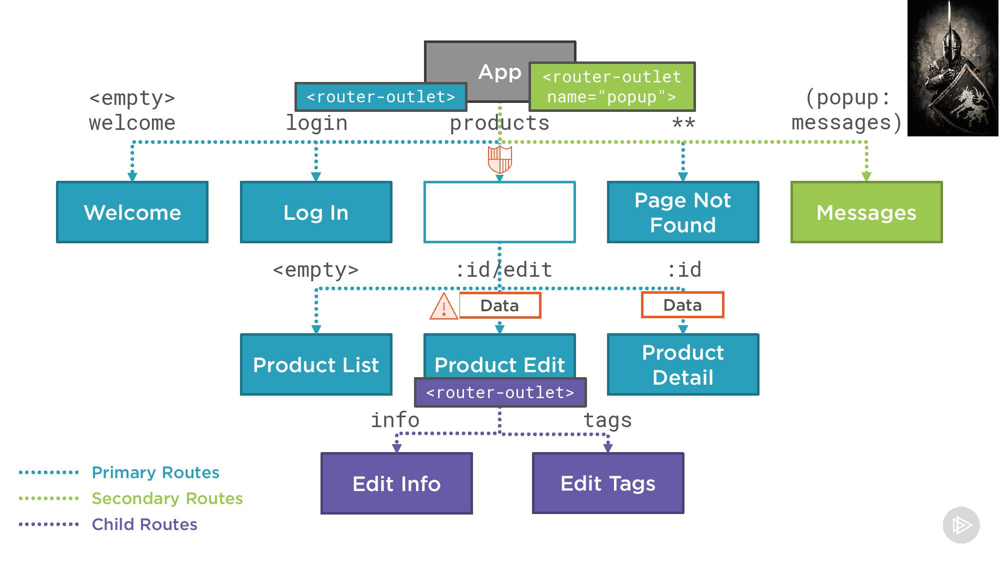  

---

Lastly, we lazy loaded our product routes to improve the startup time of our application, and we built a custom preloading strategy service so we can control which lazy loaded modules are preloaded when.
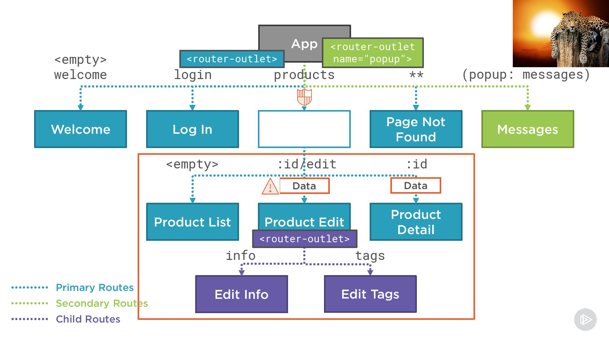  
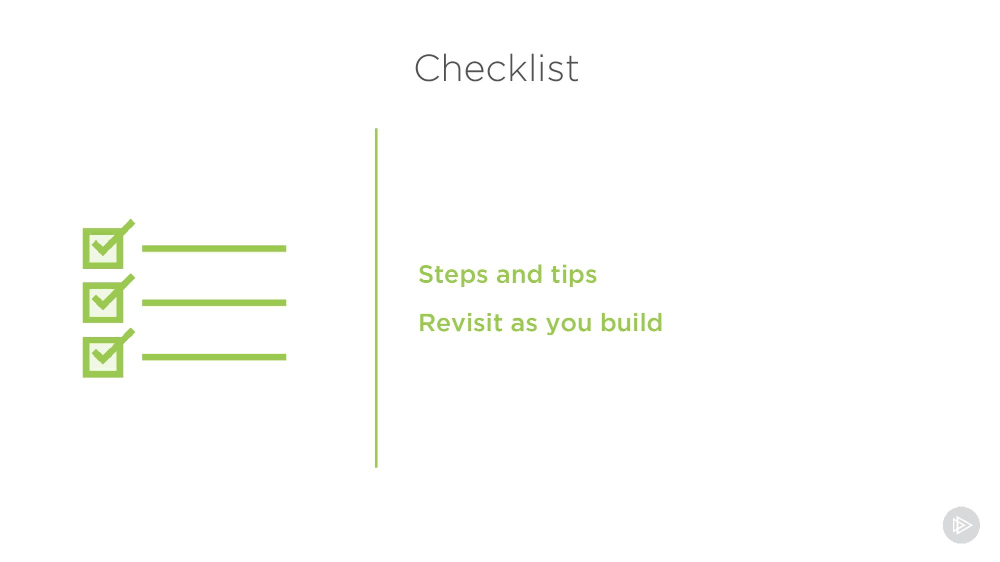  
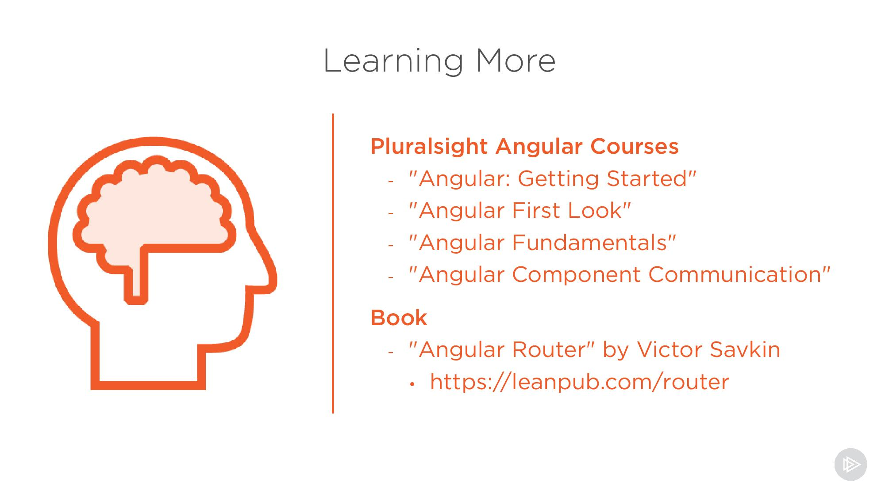  
