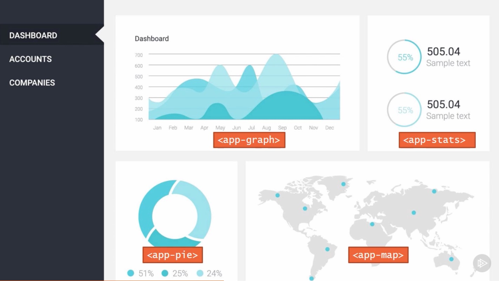
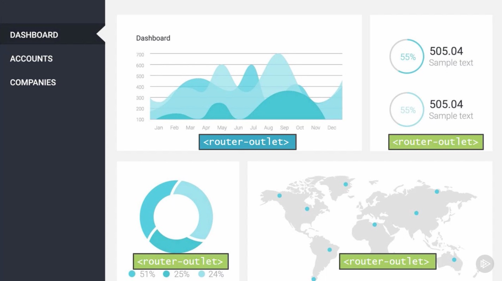
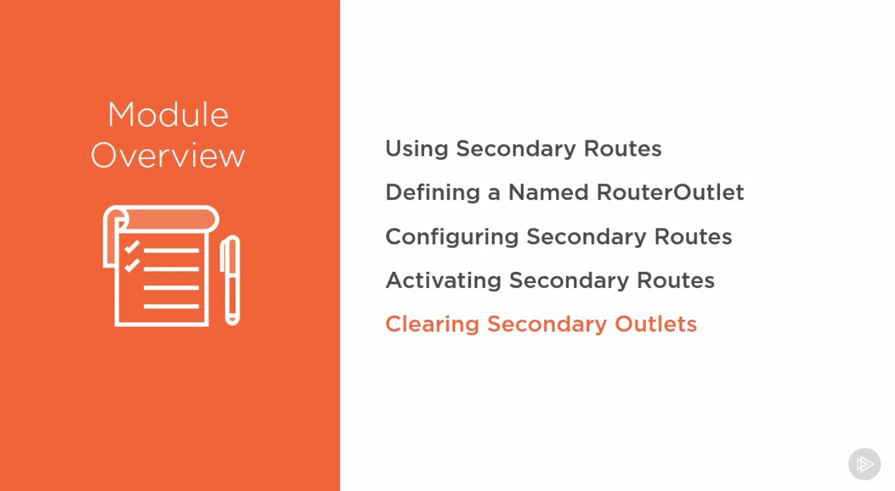
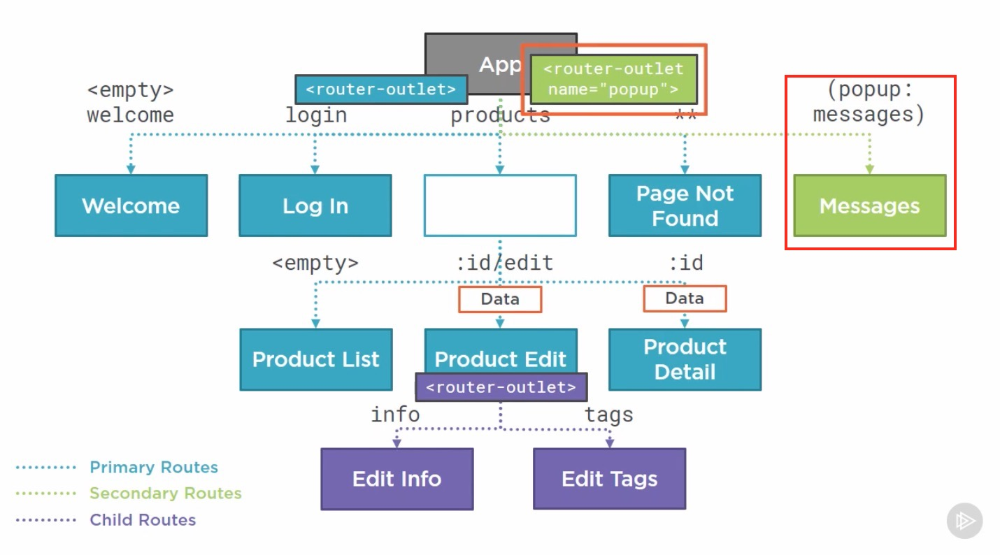

# Introduction

## Table of Contents

[Introduction](#Introduction)\

---

### Introduction

If these panes displayed a single component, then using nested component is sufficient. 
  
But imagine if each panel support independent navigation, for example click on a chart to show its details or click on a country to drill down, then each panel needs its own routing supported by one primary and any number of seconday routes.
  
  
  
