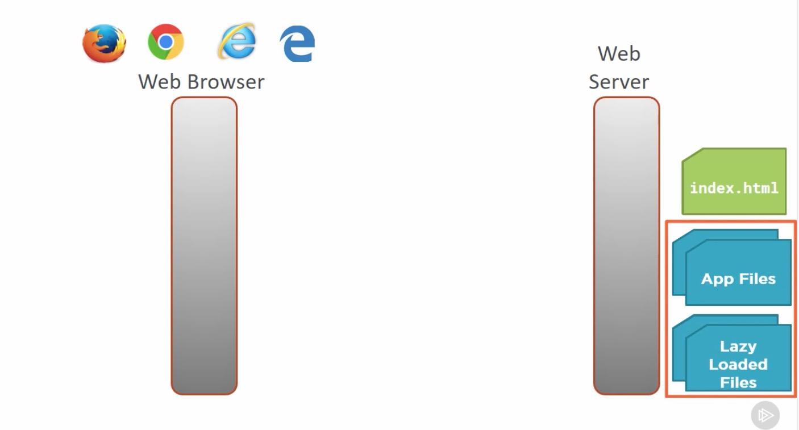
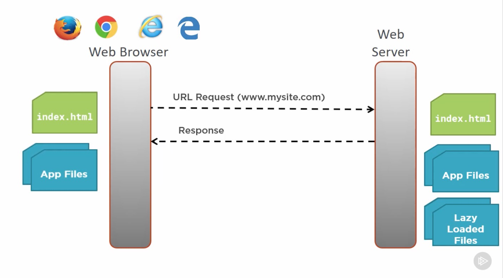
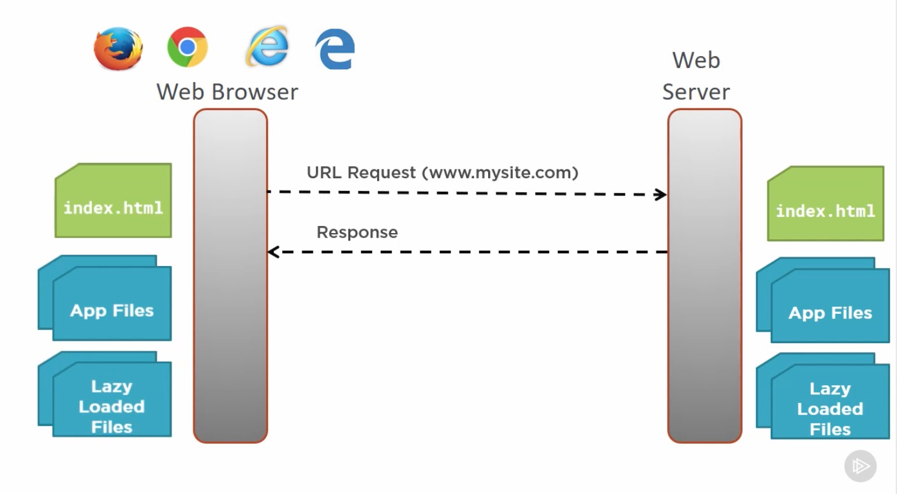
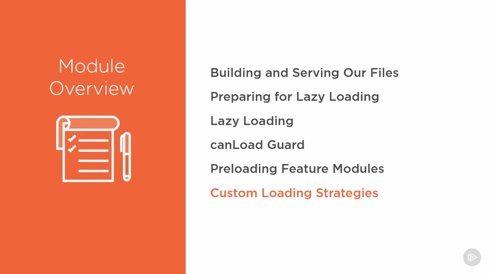
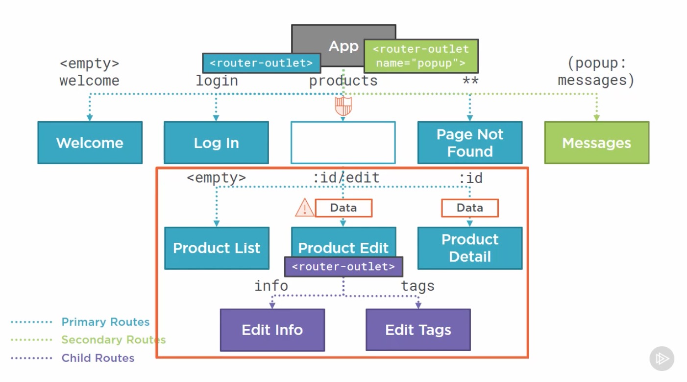
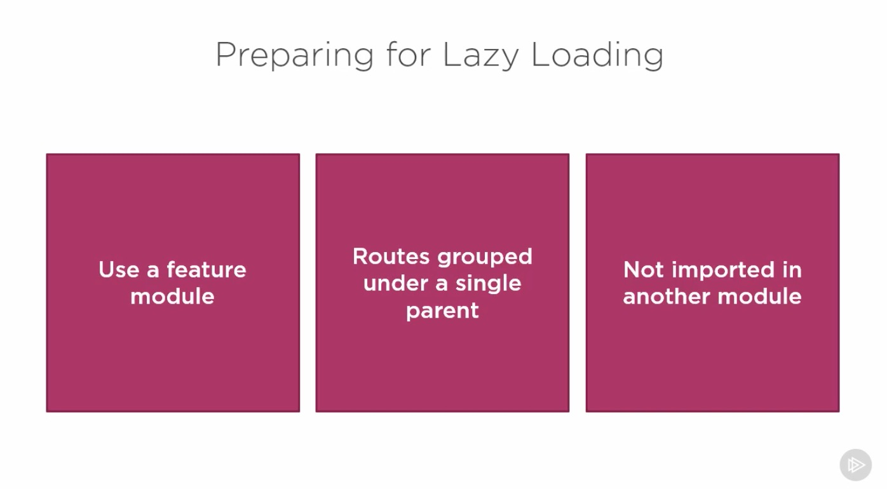
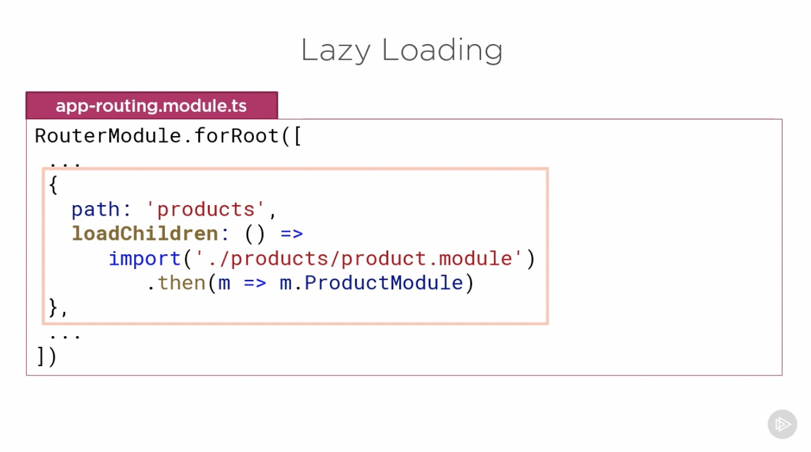
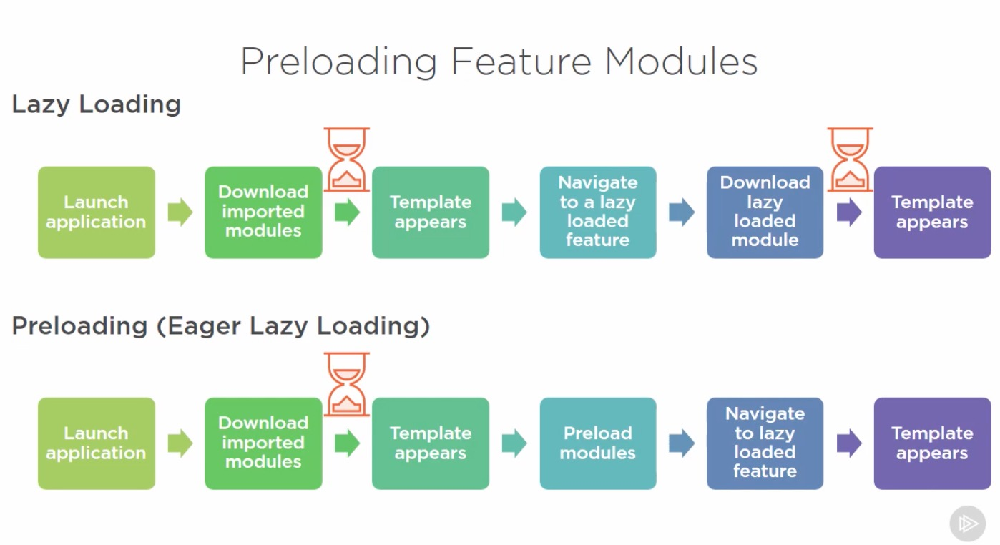
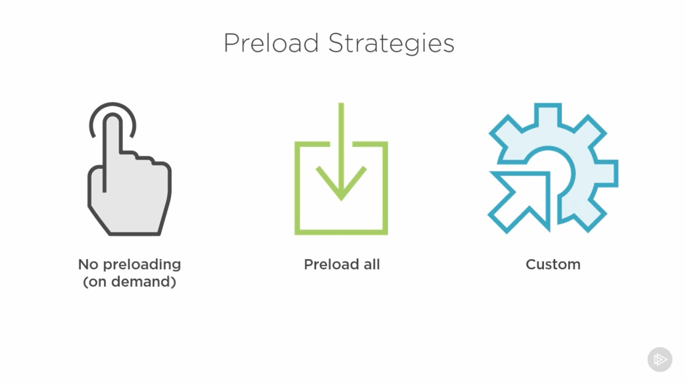
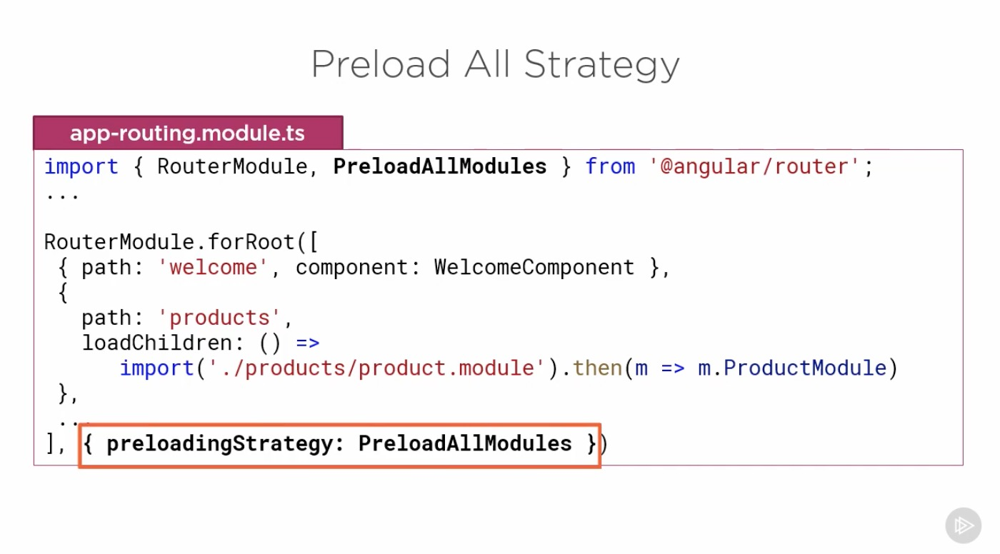

# Introduction

## Table of Contents

[Introduction](#Introduction)\
[Building and Serving Our Files](#Building-and-Serving-Our-Files)\
[Preparing for Lazy Loading](#Preparing-for-Lazy-Loading)\
[Lazy Loading](#Lazy-Loading)\
[canLoad Guard](#canLoad-Guard)\
[Preloading Feature Modules](#Preloading-Feature-Modules)\

---

### Introduction

  
  
  
  
  
  
  
  

---

### Building and Serving Our Files

The biggest file is main bundle.If we can reduce the size of that bundle, we can improve our application's startup time. That's the purpose of lazy loading. We break up our application into features so our main bundle only contains the startup code for our appliction. All of our other feature code is built into seprate modules tha are downloaded on demand or asynchronously in the background after the firs page is displayed.
  

---

### Preparing for Lazy Loading

The feature area to lazy load must meet a few requirments.
  

---

### Lazy Loading

  
  

---

### canLoad Guard

  

---

### Preloading Feature Modules

  
  
  
