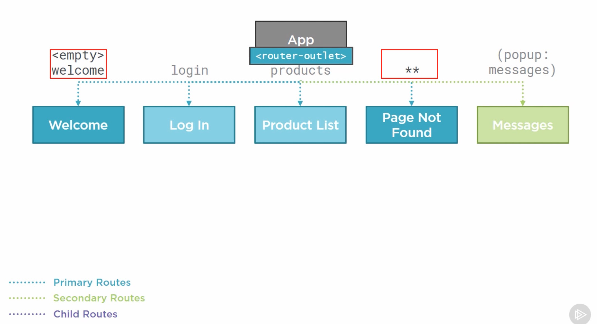

# Introduction

## Table of Contents

[Components](#components)\
[Modules](#modulas)\
[How Routing Works](#how-routing-works)\
[Components with routings](#components-with-routings)\
[Routing Basics](#routing-basics)\
[Setting up Routing](#Setting-up-Routing)\
[Defining the Base Path](#Defining-the-Base-Path)\
[Importing the Angular Roter](#Importing-the-Angular-Roter)\
[router-outlet](#router-outlet)\
[Summary](#Summary)

---

### Components

---

### Modulas

---

### How Routing Works

---

### Components with routings

---

### Routing Basics

---

### Setting up Routing

---

### Defining the Base Path

---

### Importing the Angular Roter

---

### router-outlet

---

### Summary

---
