# Introduction

## Table of Contents

[Introduction](#Introduction)\
[Using Route Guards](#Using-Route-Guards)\
[canActivate Guard](#canActivate-Guard)\
[Sharing Data](#Sharing-Data)\

---

### Introduction

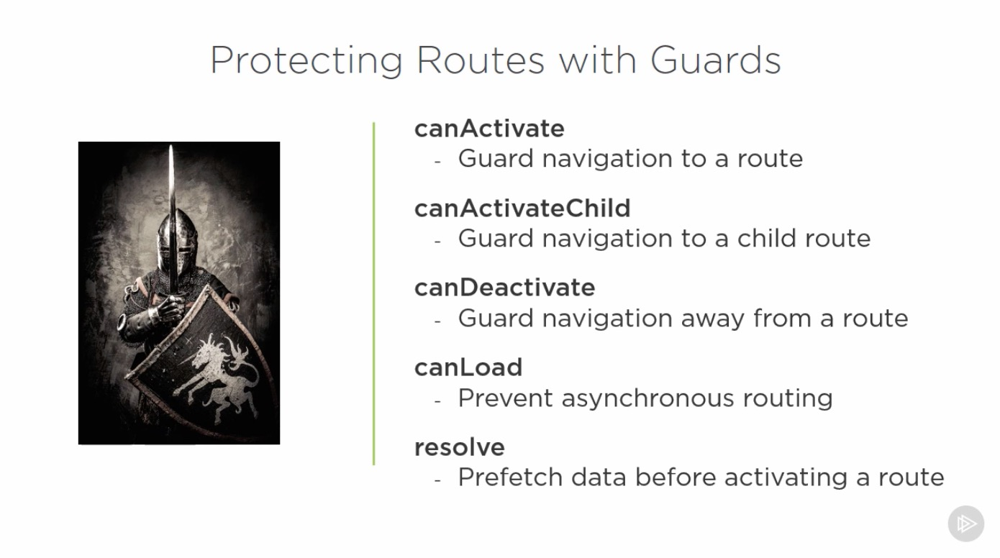  
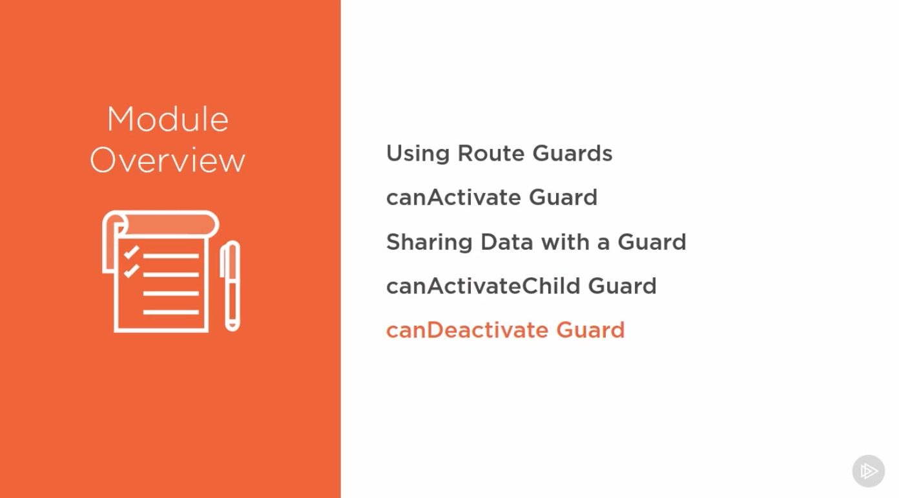  
  

---

### Using Route Guards

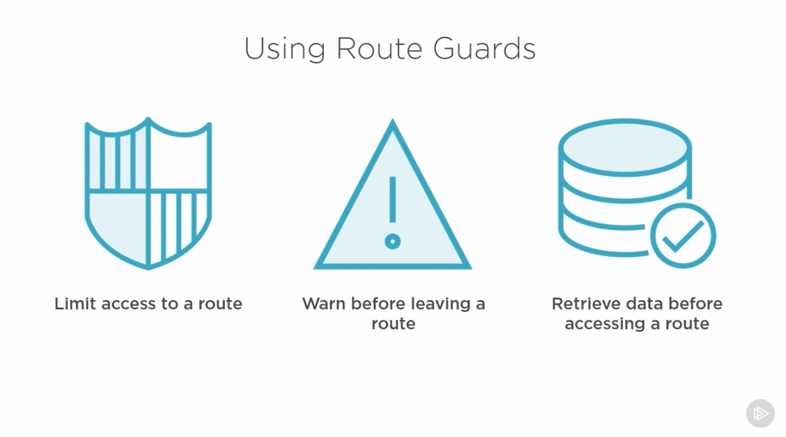  
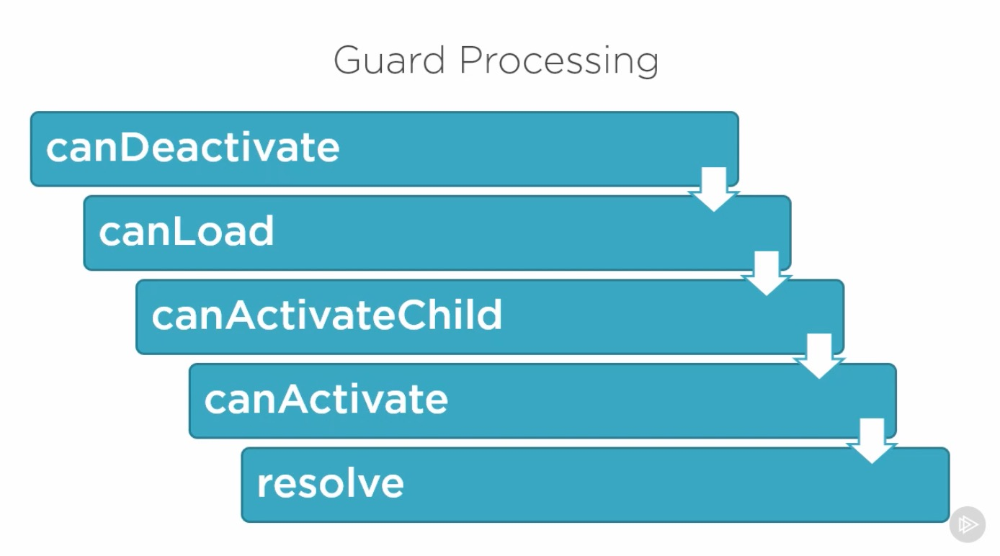  
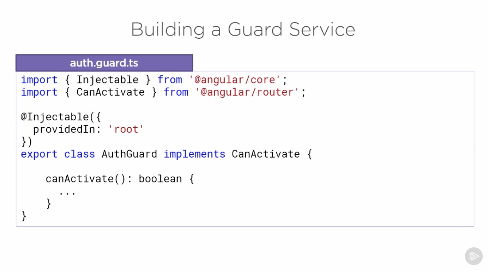  
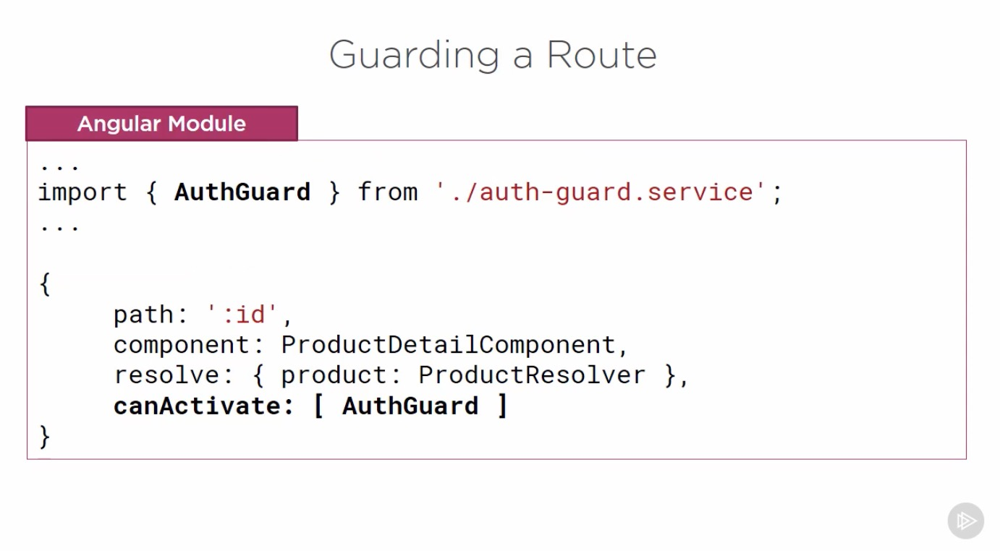  
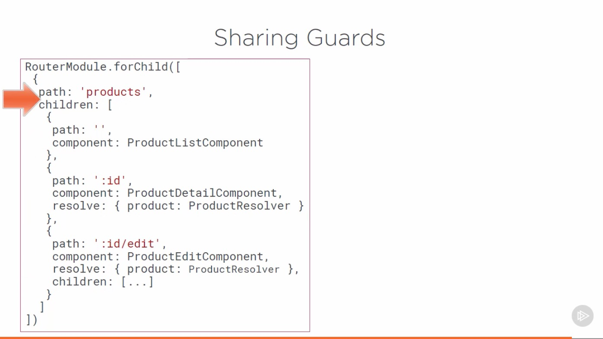  

---

### canActivate Guard

  
  
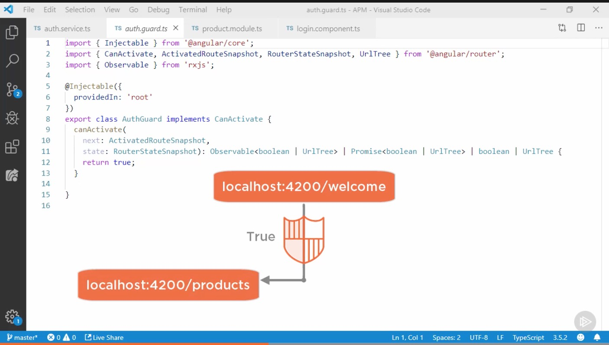  
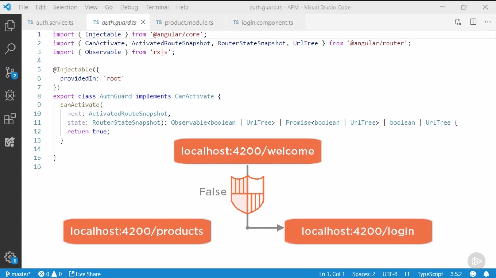  

---

### Sharing Data

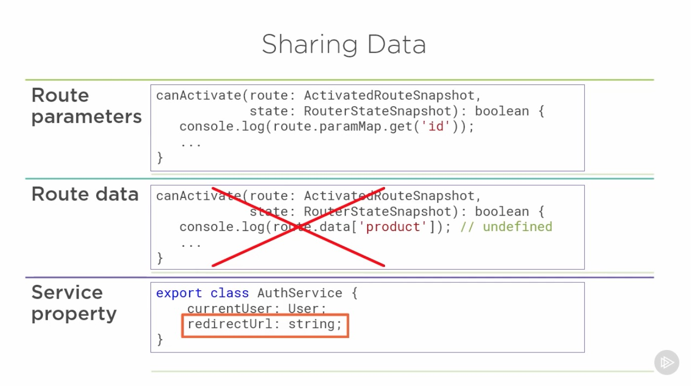  

---

### CanActivateChild Guard

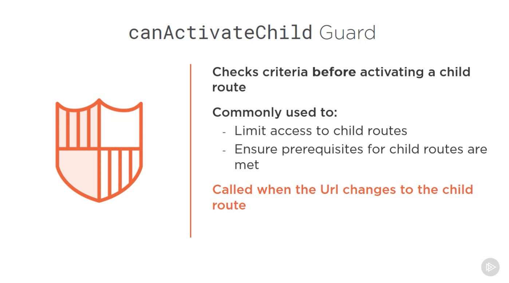  
If the user is on the Product List page and 
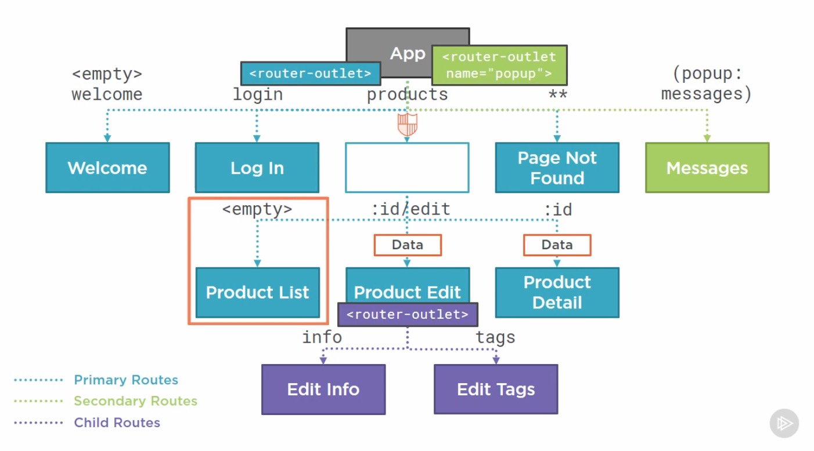  
and clicks the Add Product menu option, only the child route changes.
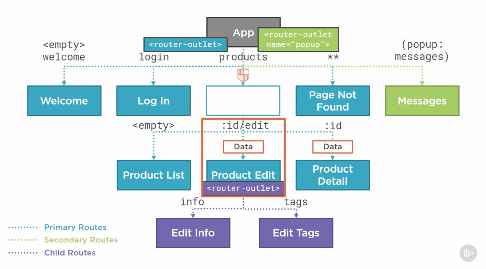  
The canActivate guards on the parent route are not executed again, but any canActivatedChild guards are.
  
Same thing for our tabs. Any canActivate guards on the parent product edit route are not re-executed
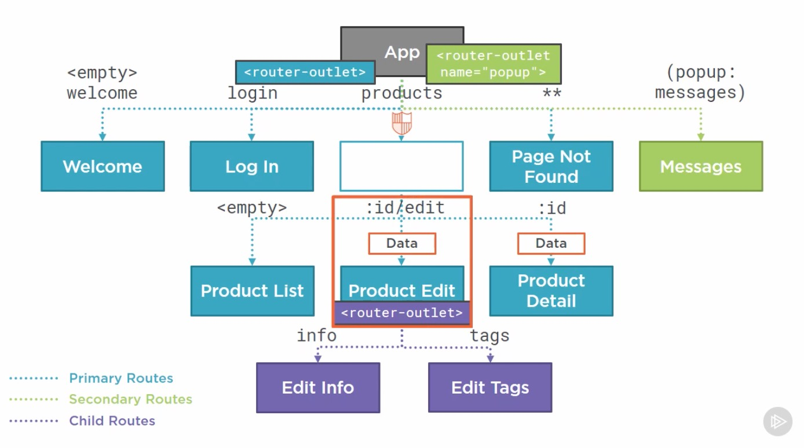  
when changing tabs, but any canActivatedChild guards are.
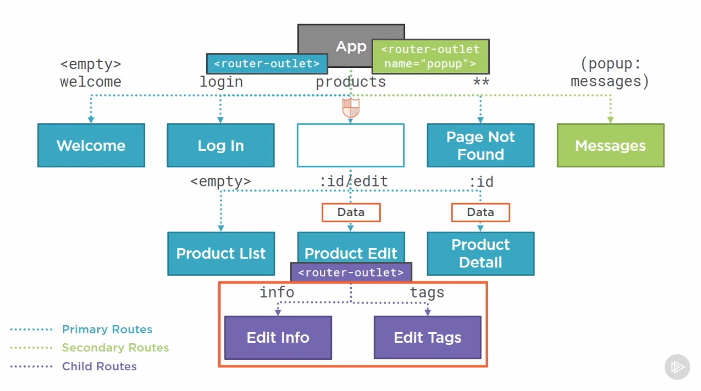  
