# Introduction

## Table of Contents

[Components](#components)\
[Modules](#modulas)\
[How Routing Works](#how-routing-works)\
[Components with routings](#components-with-routings)\
[Routing Basics](#routing-basics)\
[Setting up Routing](#Setting-up-Routing)\
[Defining the Base Path](#Defining-the-Base-Path)\
[Importing the Angular Roter](#Importing-the-Angular-Roter)\
[router-outlet](#router-outlet)\
[Summary](#Summary)

---

### Components

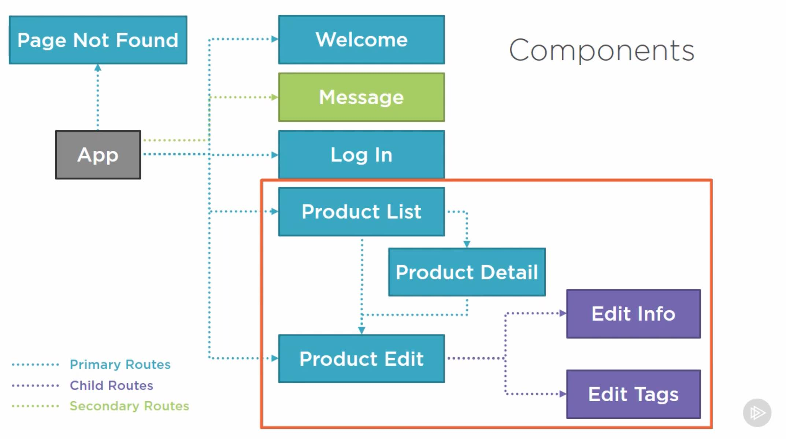

---

### Modulas

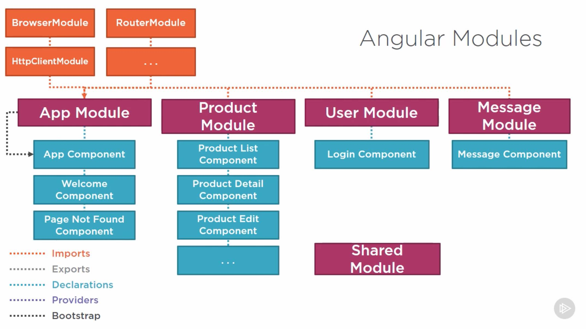

---

### How Routing Works

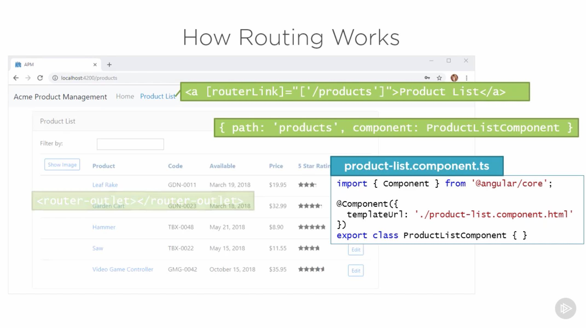

---

### Components with routings

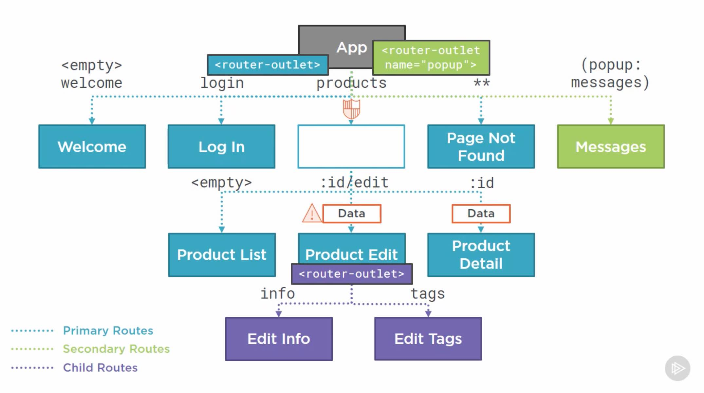

---

### Routing Basics

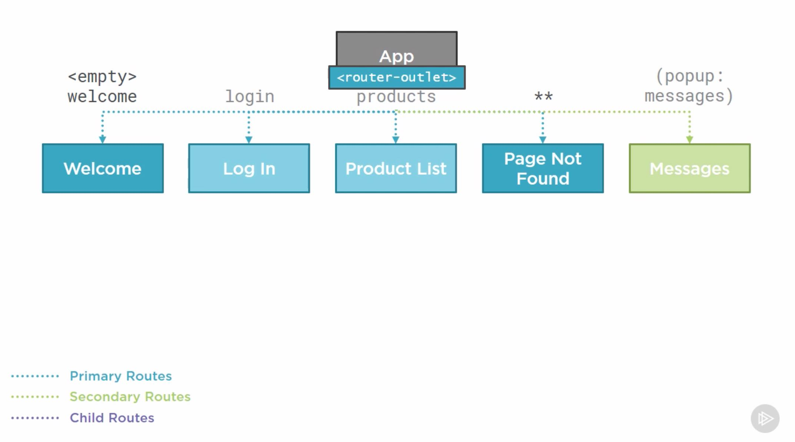

---

### Setting up Routing

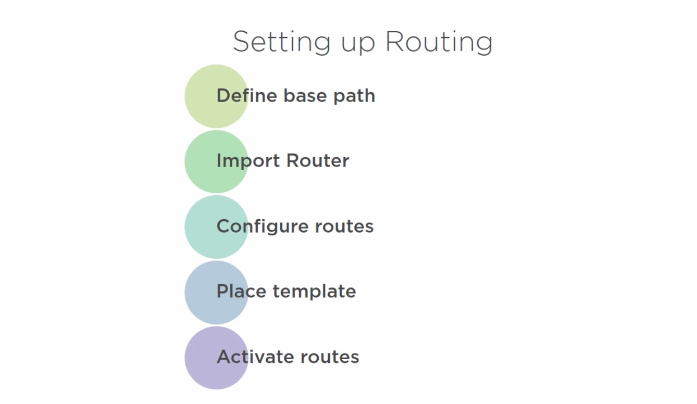

---

### Defining the Base Path

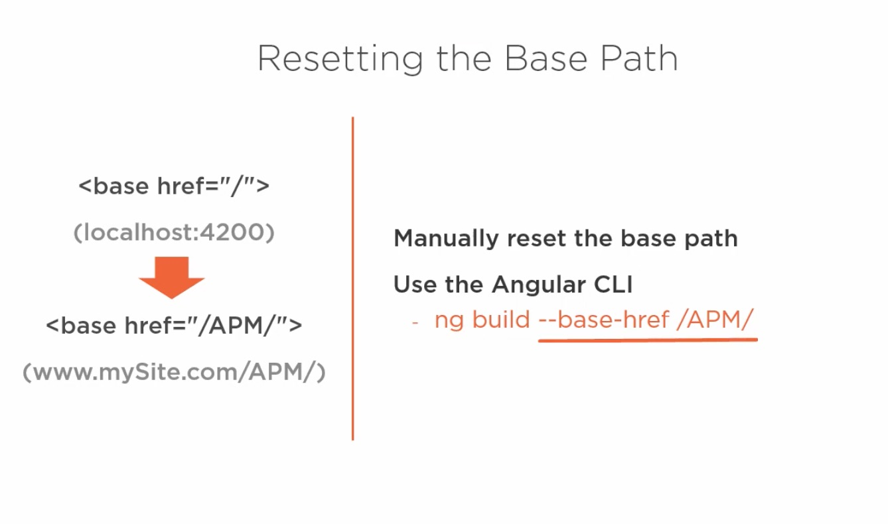

---

### Importing the Angular Roter

\
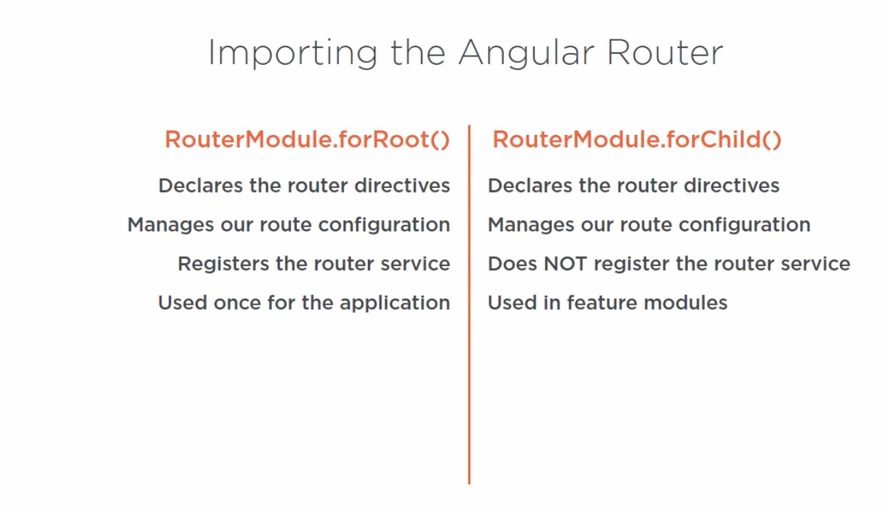\
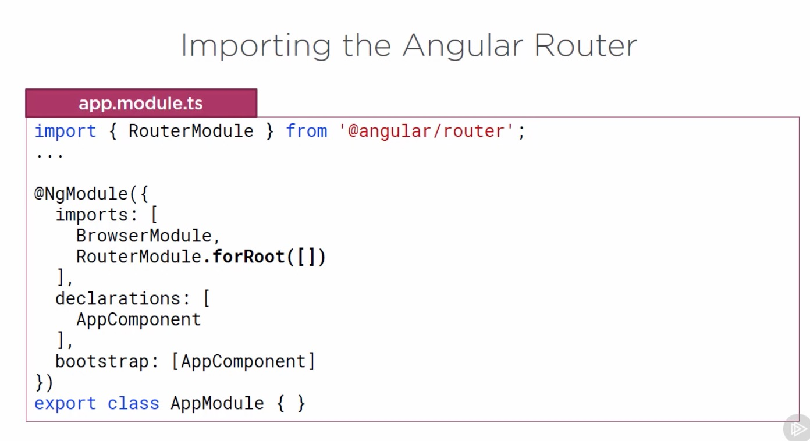

---

### router-outlet

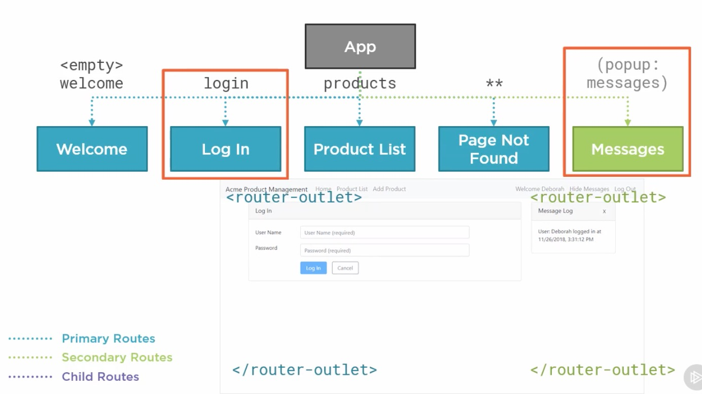

---

### Summary

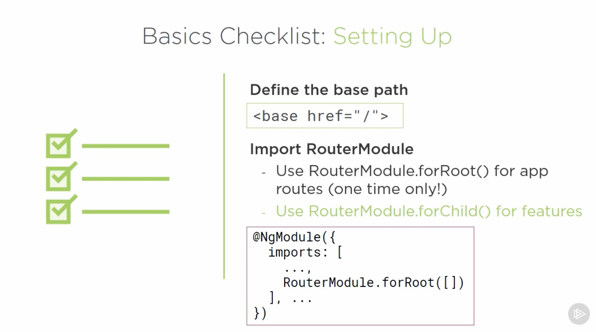
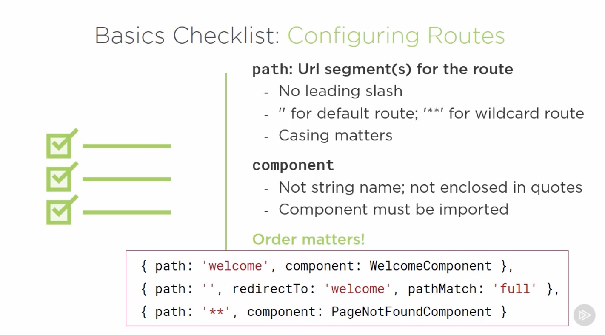
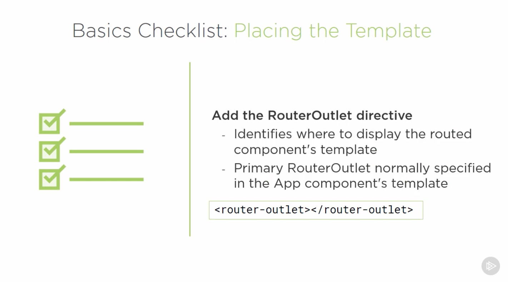
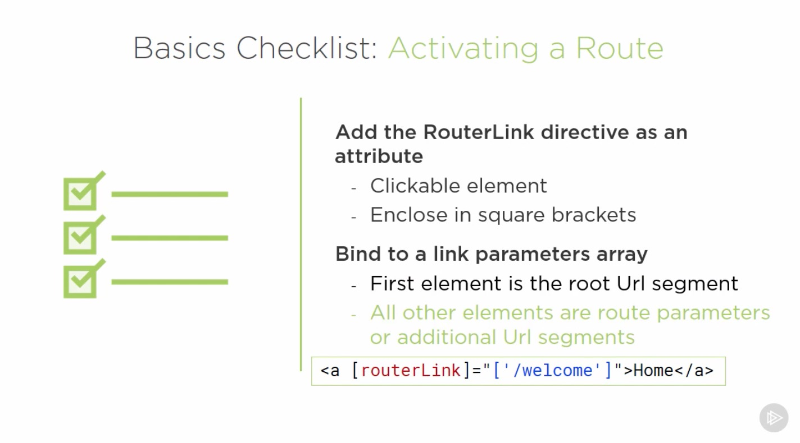
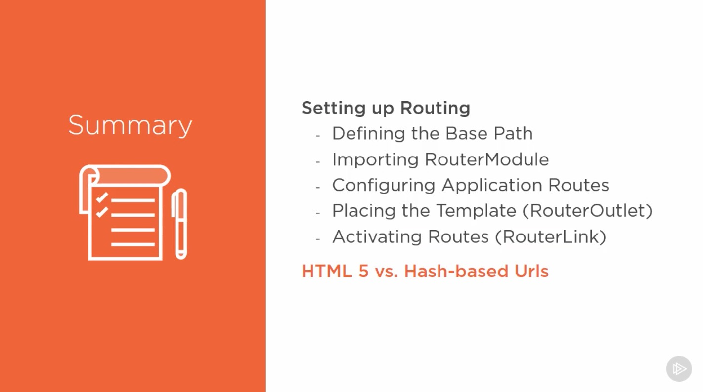

---
