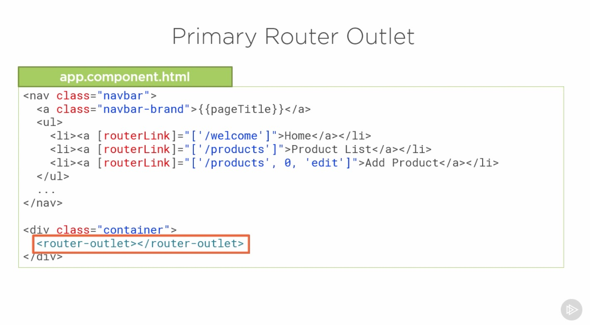
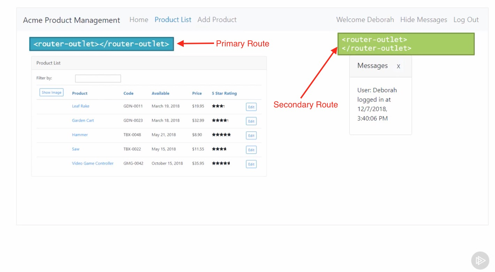
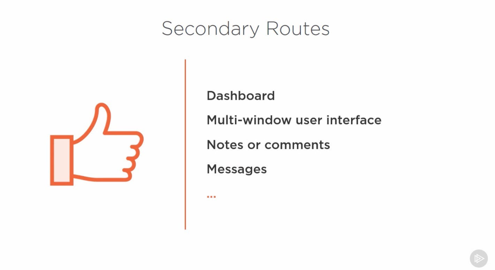
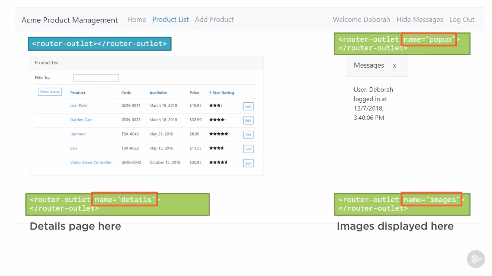
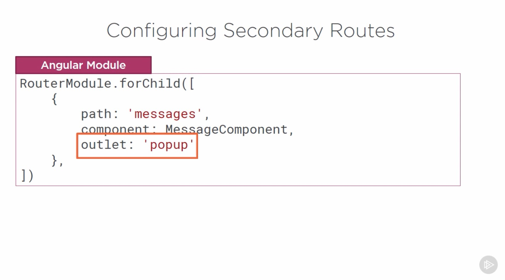
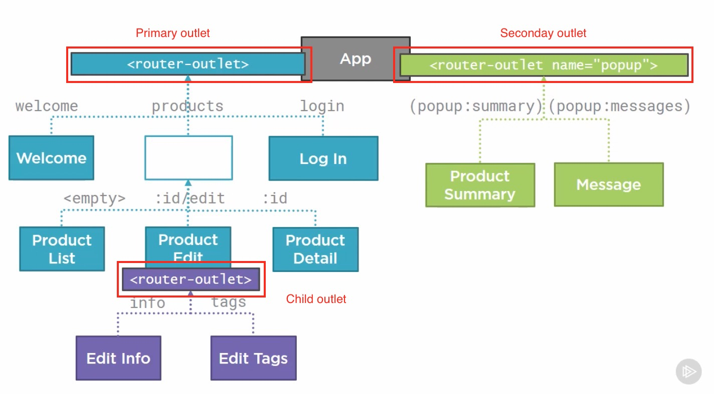
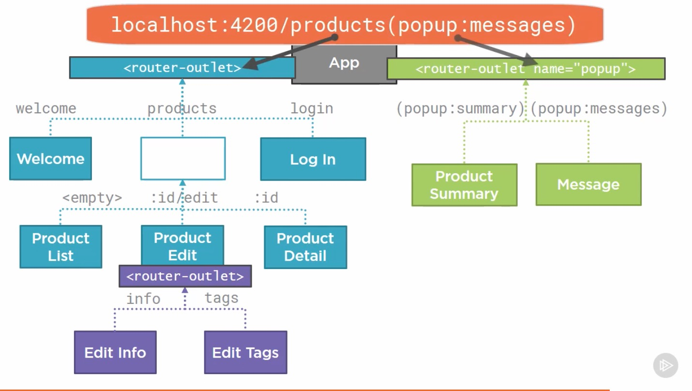
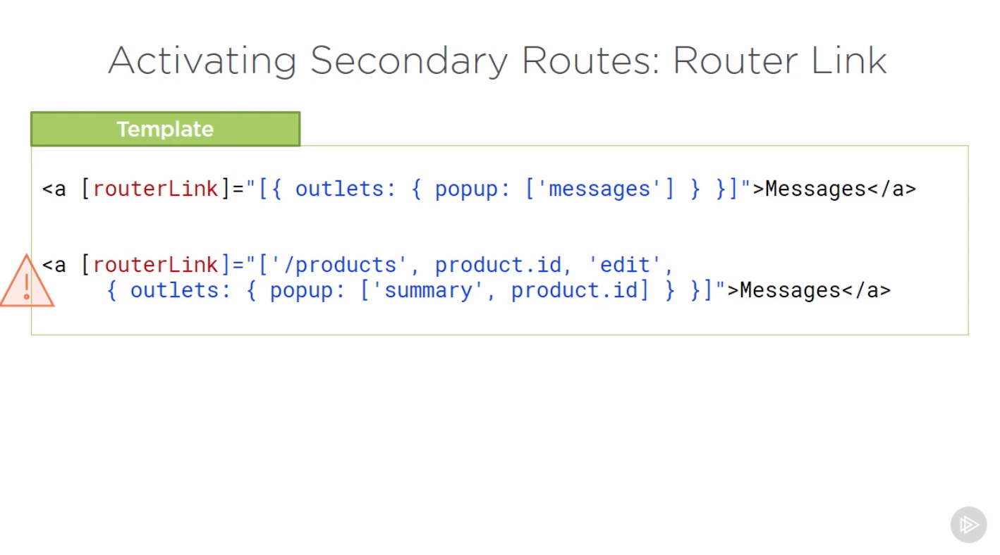
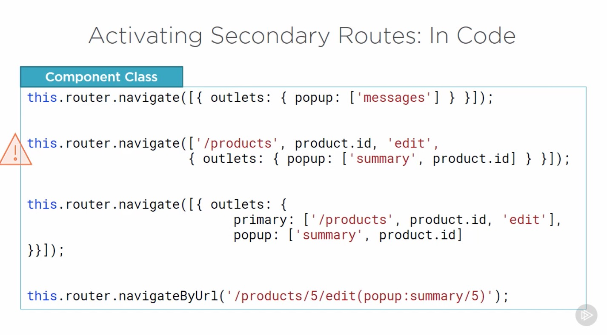
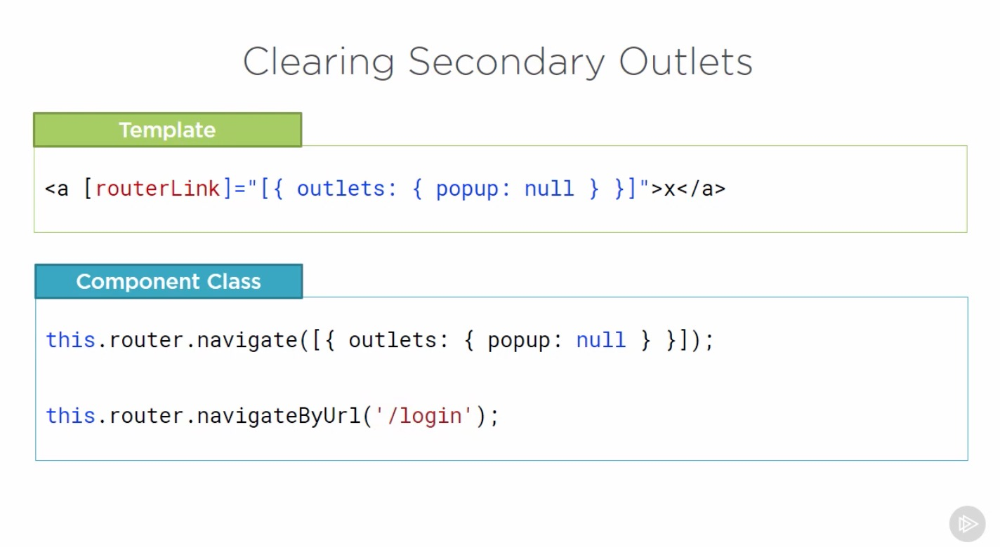

# Introduction

## Table of Contents

[Introduction](#Introduction)\
[Primary Router Outlet](#Primary-Router-Outlet)\
[Defining a Named Router Outlet](#Defining-a-Named-Router-Outlet)\
[Configuring Secondary Routes](#Configuring-Secondary-Routes)\
[Activating Secondary Routes: RouterLink](#Activating-Secondary-Routes:-RouterLink)\
[Activating Secondary Routes: In Code](#Activating-Secondary-Routes:-In-Code)\
[Clearing Secondary Outlets](#Clearing-Secondary-Outlets)\

---

### Introduction

If these panes displayed a single component, then using nested component is sufficient. 
  
But imagine if each panel support independent navigation, for example click on a chart to show its details or click on a country to drill down, then each panel needs its own routing supported by one primary and any number of seconday routes.
  
  
  

---

### Primary Router Outlet

  
  
  

---

### Defining a Named Router Outlet

  

---

### Configuring Secondary Routes

  
  
  

---

### Activating Secondary Routes: RouterLink

  

---

### Activating Secondary Routes: In Code

  

---

### Clearing Secondary Outlets

  
