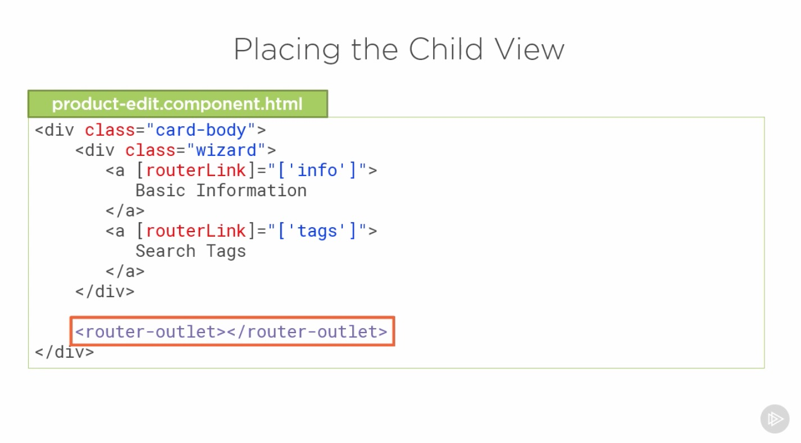

# Introduction

## Table of Contents

[Child Routes](#Child-Routes)\
[Using Child Routes](#Using-Child-Routes)\
[Configuring Child Routes](#Configuring-Child-Routes)\
[Placing the Child View](#Placing-the-Child-View)\

---

### Child Routes

---

### Using Child Routes

---

### Configuring Child Routes

---

### Placing the Child View

