# Introduction

## Table of Contents

[Prefetching Data Using Route Resolvers](#Prefetching-Data-Using-Route-Resolvers)\
[Providing Data with a Route](#Providing-Data-with-a-Route)\
[Using a Route Resolver](#Using-a-Route-Resolver)\
[Building a Route Resolver Service](#Building-a-Route-Resolver-Service)

---

### Prefetching Data Using Route Resolvers

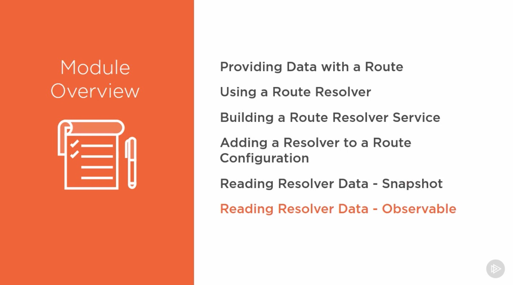

---

### Providing Data with a Route

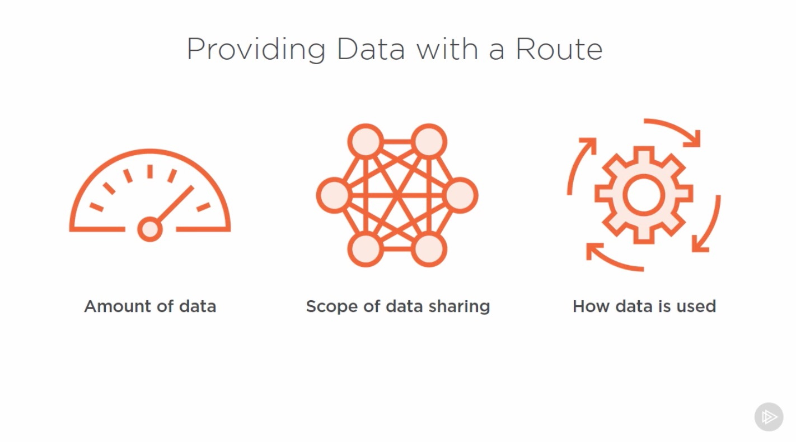
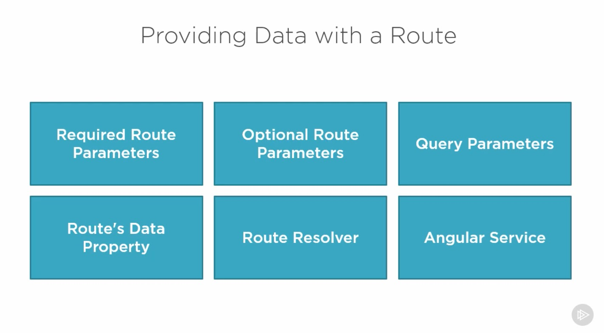
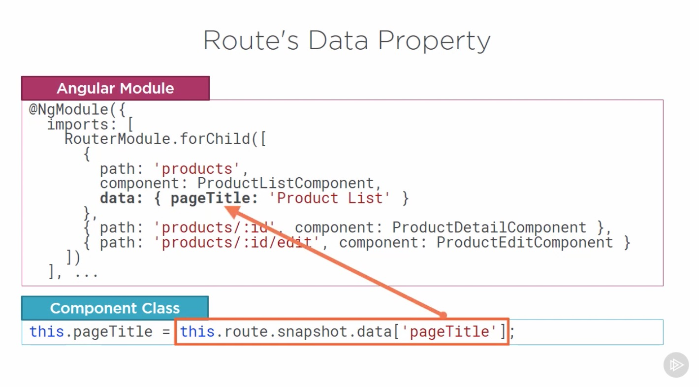

---

### Using a Route Resolver

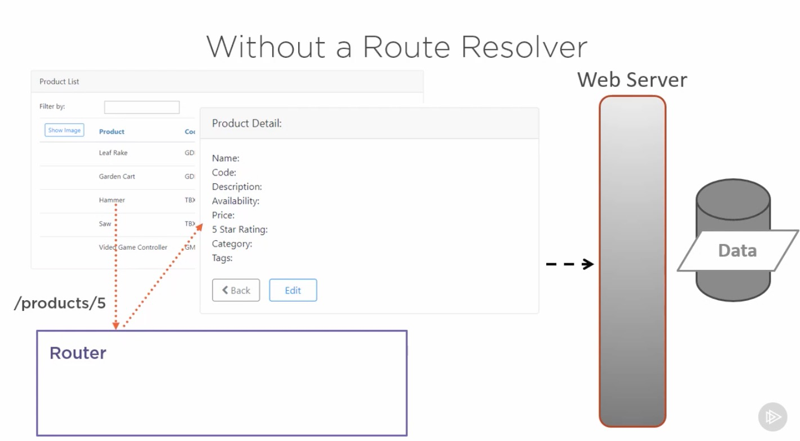
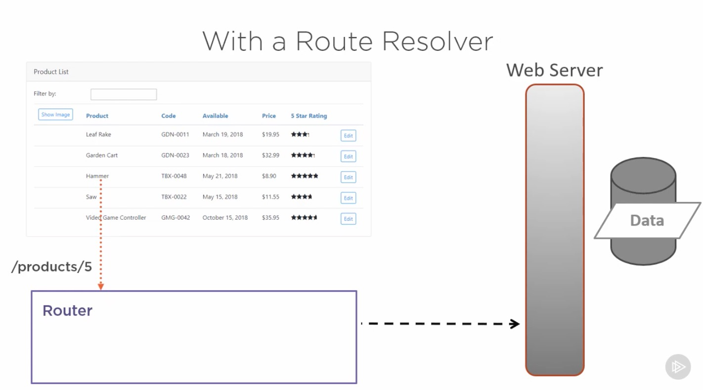
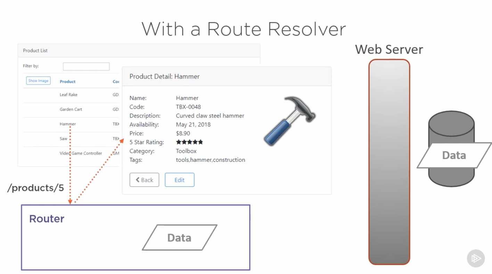
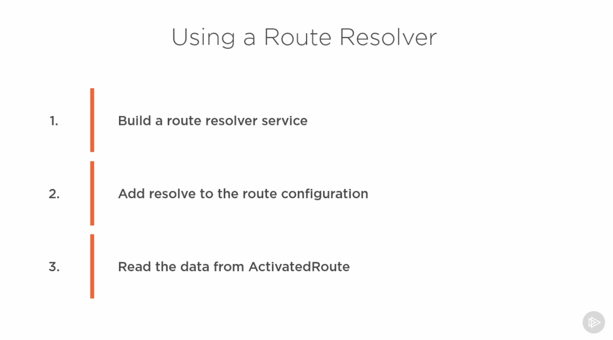
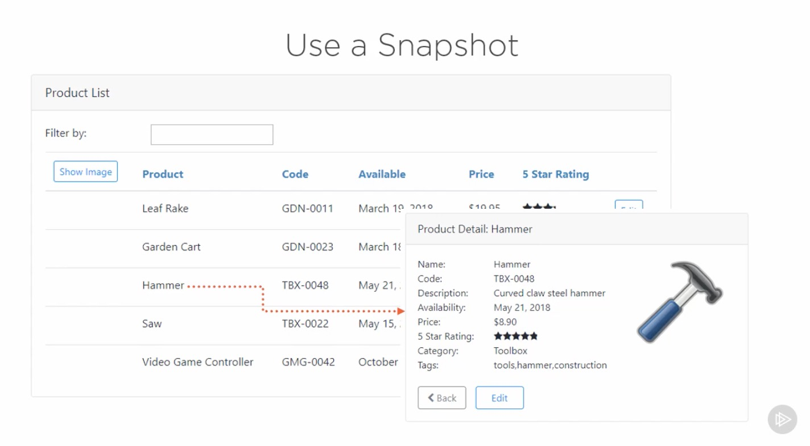
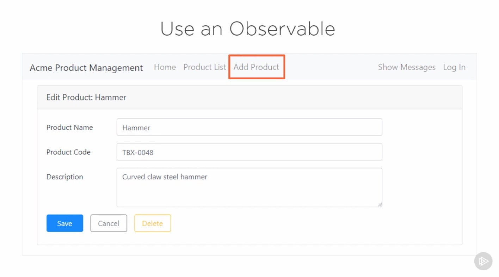  

---

### Building a Route Resolver Service

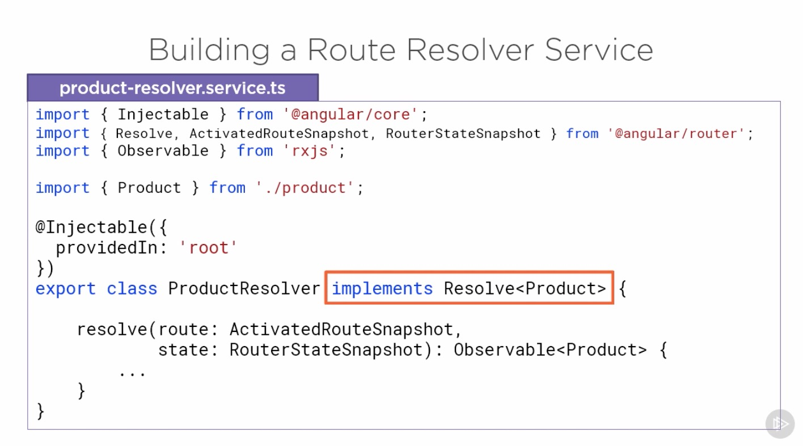  
  
  

