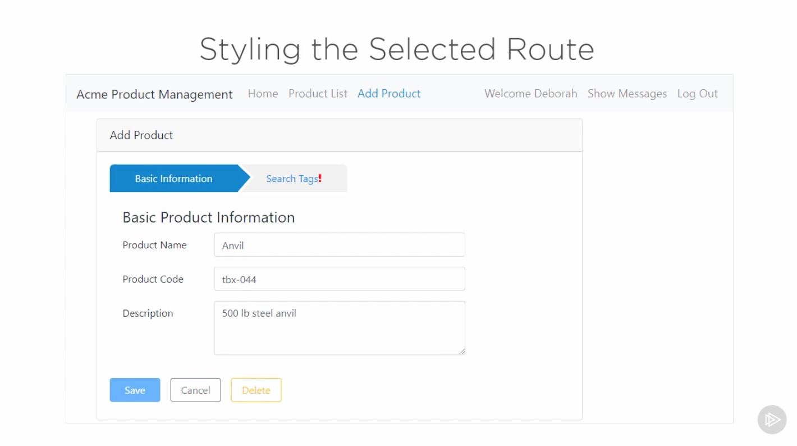
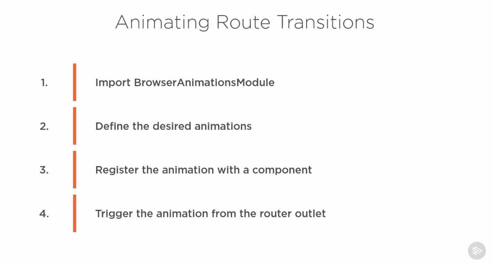

 # Introduction

## Table of Contents

[Introduction](#Introduction)\
[Styling the Selected Route](#Styling-the-Selected-Route)\
[Roting Events](#Roting-Events)\
[Reacting to Routing Events](#Reacting-to-Routing-Events)\

---

### Introduction

  

---

### Styling the Selected Route

  
  

---

### Animating Route Transitions

  

---

### Roting Events

  
Watching Routing Events
  

---

### Reacting to Routing Events

  
Watching Routing Events
  
