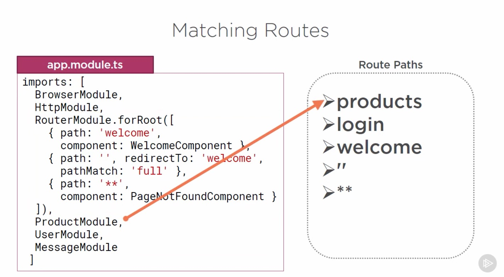
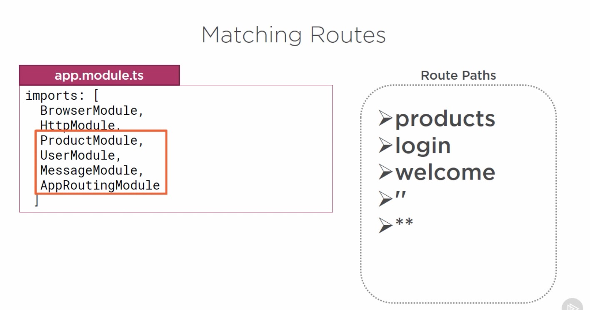

# Introduction

## Table of Contents

[Feature Modules](#Feature-Modules)\
[Setting up for Feature Routing](#Setting-up-for-Feature-Routing)\
[Route Path Naming Strategies](#Route-Path-Naming-Strategies)\
[Activate a Route with Code](#Activate-a-Route-with-Code)\
[Matching Routes](#Matching-Routes)\
[Why Define a Routing Module?](#"Why-Define-a-Routing-Module?")\
[Matching Routes with app-routing.module](#"Matching-Routes-with-app-routing.module")\
[Checklists and Summary](#Checklists-and-Summary)

---

### Feature Modules

Using single Angular modole can get a unwiedy (no separation of responsibilities)

Using feature modeles allows us to consolidate the components for a specific application feature area into their own Angular modele.

By the end of this course module we configure basic routing for 'Log In' and 'Product List' features.

---

### Setting up for Feature Routing

---

### Route Path Naming Strategies

---

### Activate a Route with Code

---

### Matching Routes

Any route defenitions that are explicitly configured in module are processed last after any imported modules.

---

### "Why Define a Routing Module?"

---

### Matching Routes with app-routing.module

\
Reordered\

---

### Checklists and Summary

\

---
